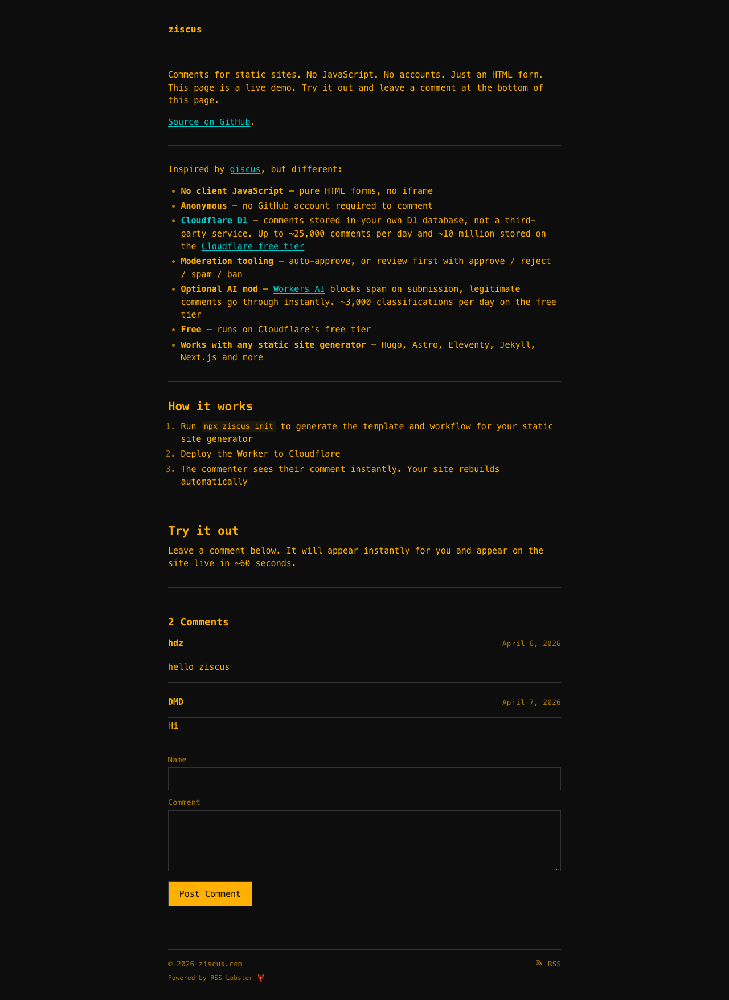
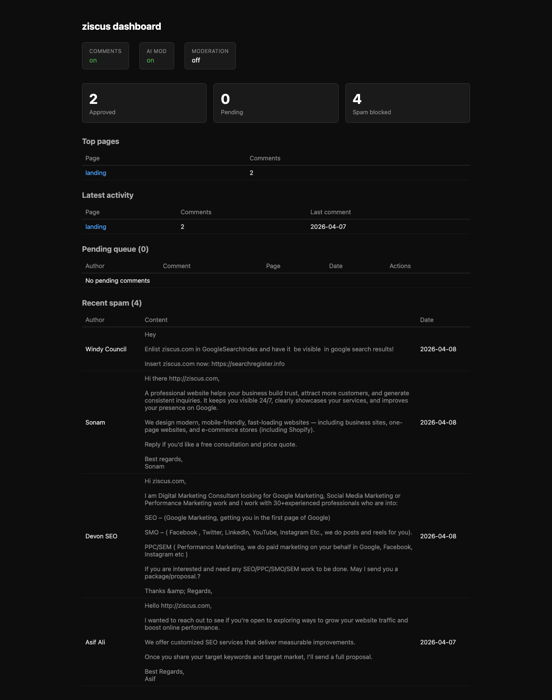

# ziscus

[](https://www.npmjs.com/package/ziscus)

Comments for static sites. No JavaScript. No accounts. Just an HTML form.

A Cloudflare Worker stores comments in [D1](https://developers.cloudflare.com/d1/), your SSG bakes them into HTML at build time. Moderation via curl.

**Live demo:** [ziscus.com](https://ziscus.com)



Inspired by [giscus](https://github.com/giscus/giscus), but different:

- **No client JavaScript** — pure HTML forms, no iframe
- **Anonymous** — no GitHub account required to comment
- **[Cloudflare D1](https://developers.cloudflare.com/d1/)** — comments stored in your own D1 database, not a third-party service. Up to ~25,000 comments per day and ~10 million stored on the [Cloudflare free tier](https://developers.cloudflare.com/d1/platform/pricing/)
- **Moderation tooling** — auto-approve, or review first with approve / reject / spam / ban
- **Optional AI mod** — [Workers AI](https://developers.cloudflare.com/workers-ai/) blocks spam on submission, legitimate comments go through instantly. ~3,000 classifications per day on the free tier
- **Free** — runs on Cloudflare's free tier
- **Works with any static site generator** — Hugo, Astro, Eleventy, Jekyll, Next.js and more

Two packages:

- **`worker/`** — Cloudflare Worker (comment storage, moderation, submission)
- **`embed/`** — TypeScript library for rendering comments as static HTML (`ziscus` on npm)

## Quick start

### CLI (fastest way)

```bash
npx ziscus init    # scaffold config and deploy the Worker
npx ziscus fetch   # pull comments and render static HTML
```

That's it. The CLI handles Worker deployment, D1 setup, and code generation. Read on if you want to understand each piece or set things up manually.

### 1. Deploy the Worker

```bash
cd worker
pnpm install

wrangler d1 create ziscus-comments
# Update wrangler.toml with your database_id and ALLOWED_ORIGINS
wrangler d1 execute ziscus-comments --remote --file=src/schema.sql

# Generate and set admin secret (save it somewhere safe — you can't retrieve it later)
NEW_SECRET=$(openssl rand -hex 32)
echo "$NEW_SECRET" | wrangler secret put ADMIN_SECRET
echo "ZISCUS_ADMIN_SECRET=$NEW_SECRET" > ../.env

wrangler deploy
```

### 2. Embed on your site

**Plain HTML:**

```html
<form method="POST" action="https://your-worker.workers.dev/submit">
  <input type="hidden" name="slug" value="your-page-slug">
  <input type="text" name="author" required>
  <textarea name="body" rows="4" required></textarea>
  <button type="submit">Post Comment</button>
</form>
```

**Static site generator (Node.js):**

```ts
import { fetchComments, renderCommentsSection, ziscusStyles } from "ziscus";

const comments = await fetchComments("my-post", "https://your-worker.workers.dev");
const html = renderCommentsSection(comments, "my-post", "https://your-worker.workers.dev/submit");
const css = ziscusStyles();
```

### 3. Moderate

```bash
npx ziscus dashboard                # open admin dashboard in browser
npx ziscus comments --status pending  # view pending queue
npx ziscus comments --status spam     # view caught spam
npx ziscus mod-log                    # moderation audit trail
```



Three global modes (`POST /admin/mode`):

| Mode | Submissions | Visibility |
|---|---|---|
| `on` (default) | Accepted | Approved only |
| `paused` | Queued as pending | Hidden |
| `off` | Rejected (403) | Hidden |

## Theming

Override CSS custom properties to match your site:

```css
#ziscus {
  --ziscus-text: #1a1a1a;
  --ziscus-bg: #fff;
  --ziscus-border: #e0e0e0;
  --ziscus-muted: #6b6b6b;
}
```

Falls back to `--color-text`, `--color-bg`, etc. if your site already uses them.

### 4. Auto-rebuild on new comments

When a comment is posted, the commenter sees it instantly. To make it visible to everyone else, the static site needs to rebuild. ziscus triggers this automatically via GitHub Actions.

**Set up the Worker secrets:**

```bash
cd worker

# Set your repo (owner/repo format)
# Already in wrangler.toml as GITHUB_REPO — update it to match your repo

# Create a fine-grained GitHub token:
# → https://github.com/settings/personal-access-tokens/new
# → Repository access: select your site repo
# → Permissions: Contents → Read and write
wrangler secret put GITHUB_TOKEN
```

**Add the workflow** (already included at `.github/workflows/rebuild-comments.yml`):

```yaml
name: Rebuild comments
on:
  repository_dispatch:
    types: [rebuild-comments]

permissions:
  contents: write

jobs:
  rebuild:
    runs-on: ubuntu-latest
    steps:
      - uses: actions/checkout@v4
      - uses: pnpm/action-setup@v4
        with: { version: 10 }
      - uses: actions/setup-node@v4
        with: { node-version: 22 }

      - name: Install rsslobster
        run: |
          git clone --depth 1 https://github.com/HectorZarate/rsslobster.git /tmp/rsslobster
          cd /tmp/rsslobster
          pnpm install --frozen-lockfile
          pnpm build
          pnpm link --global

      - name: Regenerate site
        run: cd site && rsslobster regenerate

      - name: Commit and push
        run: |
          git config user.name "github-actions[bot]"
          git config user.email "github-actions[bot]@users.noreply.github.com"
          git add site/_site/
          git diff --cached --quiet && echo "No changes" && exit 0
          git commit -m "rebuild: bake comments for ${{ github.event.client_payload.slug }}"
          git push
```

The Worker debounces rebuild triggers (30s window) to avoid flooding on bulk approvals.

## Development

```bash
pnpm install
pnpm test
pnpm typecheck
```

## Key management

ziscus uses two secrets. Both are stateless auth tokens — rotating them loses no data.

| Secret | Where it lives | What it guards |
|---|---|---|
| `ADMIN_SECRET` | Cloudflare Workers secret | All admin API endpoints |
| `GITHUB_TOKEN` | Cloudflare Workers secret | GitHub Actions rebuild trigger |

### Local `.env` file

The CLI and eval suite read `ZISCUS_ADMIN_SECRET` from a `.env` file in the project root (already in `.gitignore`):

```
ZISCUS_ADMIN_SECRET=your-secret-here
```

This is loaded automatically by `npx ziscus ai-mod status`, `npx ziscus ai-mod test`, and the eval suite.

### Rotating ADMIN_SECRET

```bash
# 1. Generate a new secret
NEW_SECRET=$(openssl rand -hex 32)

# 2. Push to Cloudflare (takes effect immediately — old key stops working)
echo "$NEW_SECRET" | npx wrangler secret put ADMIN_SECRET

# 3. Save locally for CLI/eval use
echo "ZISCUS_ADMIN_SECRET=$NEW_SECRET" > .env

# 4. Back up your secret somewhere safe (password manager, etc.)
#    Cloudflare secrets are write-only — you cannot retrieve them later.

# 5. Verify
source .env
curl -s -H "Authorization: Bearer $ZISCUS_ADMIN_SECRET" https://your-worker.workers.dev/admin/stats
```

> **Back up your admin secret.** Cloudflare secrets are write-only — `wrangler secret list` shows names but not values. If you lose it, you must rotate again.

### Rotating GITHUB_TOKEN

1. Revoke the old token at [github.com/settings/tokens](https://github.com/settings/tokens)
2. Create a new fine-grained PAT (Repository access → your site repo, Permissions → Contents: Read and write)
3. `npx wrangler secret put GITHUB_TOKEN` and paste the new token

## License

MIT
