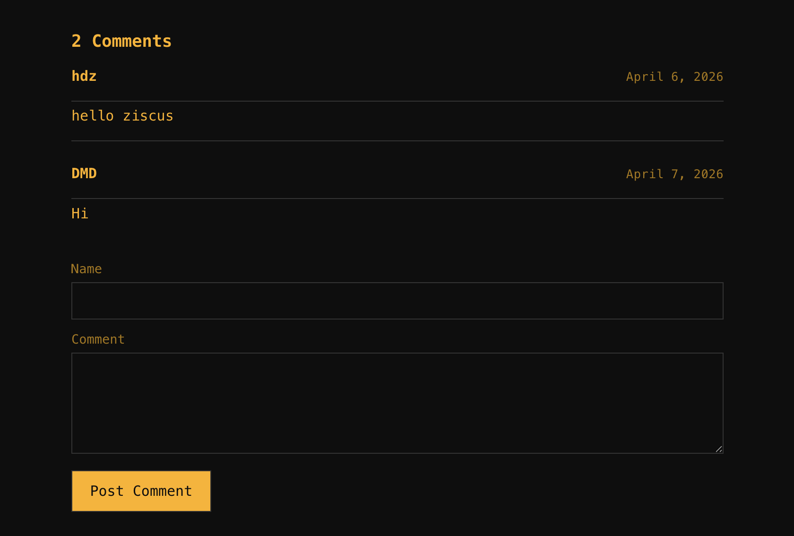
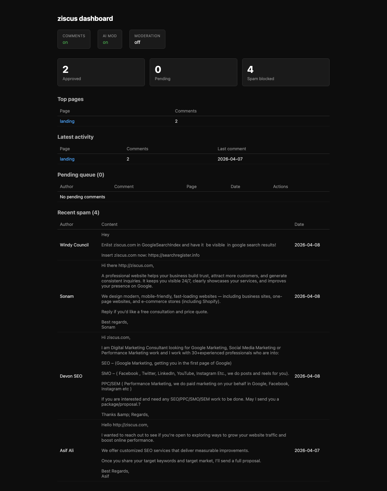

# ziscus

Comments for static sites. No JavaScript. No accounts. Just an HTML form.

A Cloudflare Worker stores comments in [D1](https://developers.cloudflare.com/d1/), your SSG bakes them into HTML at build time. Moderation via CLI and admin dashboard.

**Live demo:** [ziscus.com](https://ziscus.com) — its site lives in a separate private repo that consumes `ziscus` and `rsslobster` from npm, exactly the way you would.



Inspired by [giscus](https://github.com/giscus/giscus), but different:

- **No client JavaScript**
  - Pure HTML forms, no iframe
- **Performance**
  - Zero JavaScript to load, no bloat to tank your Lighthouse scores
  - **Read:** As fast as your CDN can serve static content (<100ms usually and >30k req/s on Cloudflare's CDN)
  - **Write:** 50 comments per second, up to 25k comments per day
- **Anonymous**
  - No GitHub account required to comment
- **[Cloudflare D1](https://developers.cloudflare.com/d1/)**
  - Comments stored in your own D1 database, not a third-party service
  - Up to ~25,000 comments per day and ~10 million stored on the [Cloudflare free tier](https://developers.cloudflare.com/d1/platform/pricing/)
- **Moderation tooling**
  - Auto-approve, or review first with approve / reject / spam / ban
- **Optional AI mod**
  - [Workers AI](https://developers.cloudflare.com/workers-ai/) blocks spam on submission, legitimate comments go through instantly
  - ~3,000 classifications per day on the free tier
- **Admin dashboard**
  - Server-rendered HTML, no JavaScript required
  - Comment stats, pending queue, recent spam, top pages, latest activity
  - One-click approve, reject, or mark as spam
- **Free**
  - Runs on Cloudflare's free tier
- **Works with any static site generator**
  - Hugo, Astro, Eleventy, Jekyll, Next.js and more

One npm package, `ziscus`, ships everything:

- **`ziscus/worker`** — the Cloudflare Worker (storage, moderation, submission, admin) — built from `worker/`
- **`ziscus`** — TypeScript renderers + `fetchComments()` for your SSG — built from `embed/`
- **`npx ziscus`** — CLI: deploy, init, moderate, rebuild, export

## Quick start

### CLI (fastest way)

In your site repo:

```bash
pnpm add -D ziscus wrangler
npx wrangler login
npx ziscus deploy --site-url https://myblog.com --ssg hugo
```

`deploy` creates the D1 database, writes `wrangler.toml` and a one-line `worker.ts`, applies the schema, generates and saves the admin secret, deploys the Worker, and scaffolds your SSG template. Then:

```bash
npx ziscus ai-mod enable       # optional: Workers AI spam filtering
npx ziscus dashboard           # print the Bearer header + open the admin dashboard
```

Read on if you want to understand each piece or set things up by hand.

### 1. Deploy the Worker

The whole Worker is one line — `worker.ts`:

```ts
export { default } from "ziscus/worker";
```

`wrangler.toml`:

```toml
name = "ziscus-comments"
main = "worker.ts"
compatibility_date = "2025-09-27"

[[d1_databases]]
binding = "DB"
database_name = "ziscus-comments"
database_id = "<from `wrangler d1 create`>"

[vars]
ALLOWED_ORIGINS = "myblog.com"        # comma-separated hosts allowed to POST /submit
MODERATION = "off"                    # "on" holds new comments for review
RATE_LIMIT = "30"                     # comments per IP per hour
GITHUB_REPO = "you/your-site-repo"    # receives repository_dispatch rebuild triggers

# Optional — serve your static site from the same Worker (this is how ziscus.com
# runs). Enables the instant "see your own comment" preview.
# [assets]
# directory = "_site"
# binding = "ASSETS"
# run_worker_first = true

# Optional — AI spam filtering
# [ai]
# binding = "AI_MOD"
```

```bash
wrangler d1 create ziscus-comments                # paste the id into wrangler.toml
wrangler d1 execute ziscus-comments --remote --file=node_modules/ziscus/dist/schema.sql

SECRET=$(openssl rand -hex 32)                    # save it — Cloudflare secrets are write-only
echo "ZISCUS_ADMIN_SECRET=$SECRET" >> .env
echo "$SECRET" | wrangler secret put ADMIN_SECRET

wrangler deploy
```

### 2. Embed on your site

**Plain HTML:**

```html
<form method="POST" action="https://your-worker.workers.dev/submit">
  <input type="hidden" name="slug" value="your-page-slug">
  <input type="text" name="author" required>
  <textarea name="body" rows="4" required></textarea>
  <button type="submit">Post Comment</button>
</form>
```

**Static site generator (Node.js):**

```ts
import { fetchComments, renderCommentsSection, ziscusStyles } from "ziscus";

const comments = await fetchComments("my-post", "https://your-worker.workers.dev");
const html = renderCommentsSection(comments, "my-post", "https://your-worker.workers.dev/submit");
const css = ziscusStyles();
```

`fetchComments()` returns plain text (the API stores it HTML-escaped); the renderers escape exactly once.

### 3. Moderate

```bash
npx ziscus dashboard                  # print the Bearer header + open dashboard
npx ziscus comments --status pending  # view pending queue
npx ziscus comments --status spam     # view caught spam
npx ziscus mod-log                    # moderation audit trail
npx ziscus rebuild                    # force a site rebuild + prove the GitHub token works
npx ziscus export --redact-ip         # backup (redact ip_hash if it lands anywhere public)
```



> **Dashboard auth is header-only.** The admin secret is never placed in a URL
> (query-string secrets leak into browser history, proxy/CDN logs, `Referer`
> headers, and search indexes). Every admin request must carry
> `Authorization: Bearer $ADMIN_SECRET`. From the terminal this is automatic.
> In a browser, set the header once for your worker's host with a request-header
> extension (e.g. [ModHeader](https://modheader.com/) or Requestly), then open
> `/admin/dashboard`. `npx ziscus dashboard` prints the exact header to add.

Three global modes (`POST /admin/mode`):

| Mode | Submissions | Visibility |
|---|---|---|
| `on` (default) | Accepted | Approved only |
| `paused` | Queued as pending | Hidden |
| `off` | Rejected (403) | Hidden |

### 4. Auto-rebuild on new comments

The commenter sees their comment instantly (when the Worker serves your site, via a flash-cookie preview). Everyone else sees it after your site rebuilds: on every approved comment the Worker fires a GitHub `repository_dispatch` (`event_type: rebuild-comments`, payload `{ slug }`) at `GITHUB_REPO`, debounced 30s. Your site repo's workflow does the rest — bake, then deploy to wherever you host. `npx ziscus init` scaffolds one for your SSG; ziscus.com's own is: regenerate with rsslobster → upload a redacted backup artifact → `wrangler deploy`. Nothing is committed back.

```bash
# Fine-grained PAT → https://github.com/settings/personal-access-tokens/new
#   Repository access: your site repo · Permissions: Contents → Read and write
wrangler secret put GITHUB_TOKEN
```

**Is the pipeline healthy?** Every dispatch attempt is recorded, so a dead token can't fail silently:

- `npx ziscus rebuild` — forces a dispatch and prints GitHub's verdict: `✓ Rebuild dispatched (GitHub 204)` or `✗ Rebuild failed: GitHub 401: Bad credentials`.
- The **Rebuild pipeline** card on `/admin/dashboard` shows the last outcome and has a *rebuild now* button.
- `GET /admin/stats` returns a `rebuild` field; `npx ziscus mod-log --action rebuild_failed` lists failures.

A failed dispatch releases the debounce window so the next approval retries immediately. Add a daily `schedule:` to your workflow as a safety net — an expired token then delays publishing by at most a day.

## Theming

Override CSS custom properties to match your site:

```css
#ziscus {
  --ziscus-text: #1a1a1a;
  --ziscus-bg: #fff;
  --ziscus-border: #e0e0e0;
  --ziscus-muted: #6b6b6b;
}
```

Falls back to `--color-text`, `--color-bg`, etc. if your site already uses them.

## Development

```bash
pnpm install
pnpm test          # worker (Workers pool) + embed
pnpm typecheck
cd embed && pnpm build && npm pack --dry-run   # what ships: dist/{index,cli,worker}.js, worker.d.ts, schema.sql
```

`worker/wrangler.toml` is this repo's dev/test config only (it serves a fixture site from `worker/test/site`). Nothing here deploys ziscus.com.

## Key management

ziscus uses two secrets. Both are stateless auth tokens — rotating them loses no data.

| Secret | Where it lives | What it guards |
|---|---|---|
| `ADMIN_SECRET` | Cloudflare Workers secret | All admin API endpoints |
| `GITHUB_TOKEN` | Cloudflare Workers secret | GitHub Actions rebuild trigger |

### Local `.env` file

The CLI and eval suite read `ZISCUS_ADMIN_SECRET` from a `.env` file in the project root (already in `.gitignore`):

```
ZISCUS_ADMIN_SECRET=your-secret-here
```

This is loaded automatically by `npx ziscus ai-mod status`, `npx ziscus ai-mod test`, and the eval suite.

### Rotating ADMIN_SECRET

```bash
# 1. Generate a new secret
NEW_SECRET=$(openssl rand -hex 32)

# 2. Push to Cloudflare (takes effect immediately — old key stops working)
echo "$NEW_SECRET" | npx wrangler secret put ADMIN_SECRET

# 3. Save locally for CLI/eval use
echo "ZISCUS_ADMIN_SECRET=$NEW_SECRET" > .env

# 4. Back up your secret somewhere safe (password manager, etc.)
#    Cloudflare secrets are write-only — you cannot retrieve them later.

# 5. Verify
source .env
curl -s -H "Authorization: Bearer $ZISCUS_ADMIN_SECRET" https://your-worker.workers.dev/admin/stats
```

> **Back up your admin secret.** Cloudflare secrets are write-only — `wrangler secret list` shows names but not values. If you lose it, you must rotate again.

### Rotating GITHUB_TOKEN

1. Revoke the old token at [github.com/settings/tokens](https://github.com/settings/tokens)
2. Create a new fine-grained PAT (Repository access → your site repo, Permissions → Contents: Read and write)
3. `wrangler secret put GITHUB_TOKEN` and paste the new token

> **Fine-grained PATs expire** (GitHub caps them at one year; the default is much shorter). When the token dies the Worker keeps accepting comments but GitHub rejects every rebuild dispatch. You'll see it as a red **Rebuild pipeline** card on the dashboard, `GitHub 401` from `npx ziscus rebuild`, and `rebuild_failed` entries in the mod log — and the workflow's daily schedule still publishes within a day. Put the expiry date on a calendar.

## License

MIT
